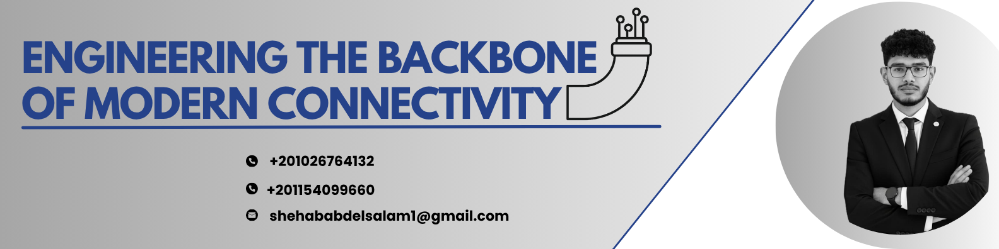

<!-- ═══════════════════════════ BANNER ═══════════════════════════ -->
<!-- ارفع صورة البانر بتاعتك (اللي فيها Engineering the Backbone...) على الريبو نفسه
     في مجلد اسمه assets مثلاً، وغيّر الرابط تحت ده لمسار الصورة عندك -->

  

<!-- ═══════════════════════════ QUICK LINKS ═══════════════════════════ -->

&nbsp;

 

---

##  Who Am I

**Electronics and Communications Engineering** student at **Qena University**, focused on **Enterprise and Service Provider Networking**. Passionate about understanding how enterprise and service provider networks are designed, deployed, operated, and secured.

I like understanding how networks actually work under the hood — from Packet Tracer topologies to full virtual labs in GNS3 and EVE-NG — before layering automation on top with Python.

Alongside networking, I lead technical teams and manage communications for several student engineering activities — I enjoy the technical side as much as the coordination side.

 

---

##  Skills & Technologies

**Core Tools**

  

**Networking, Security & Automation**

 

 

---

##  Core Focus Areas

<table width="100%">
<tr>
<td width="50%" valign="top">

### 🔀 Routing & Switching
Enterprise routing, switching, and network design fundamentals — CCNA and CCNP ENCOR level topics, built and tested in Packet Tracer, GNS3, and EVE-NG labs.

</td>
<td width="50%" valign="top">

### 🛡️ Security
Network security concepts and hands-on practice with CCNP SCOR, CyberOps material, and FortiGate firewall configuration.

</td>
</tr>
<tr>
<td width="50%" valign="top">

### 🤖 Automation & Programming
Using Python and Cisco DevNet concepts to automate repetitive network tasks, plus exploring AI-driven automation workflows.

</td>
<td width="50%" valign="top">

### 🖥️ Simulation Environments
Comfortable building and troubleshooting multi-device topologies across Packet Tracer, GNS3, and EVE-NG for realistic lab scenarios.

</td>
</tr>
</table>

 

---

##  Currently Learning

- **MCSA** — Microsoft server administration fundamentals
- **Spiceworks** — IT asset & help desk management
- **FreePBX / Asterisk** — VoIP and PBX systems

 

---

##  Beyond Tech — Leadership & Activities

- Head of **Embedded Systems**, Racing SVU Team
- Head of **Embedded Systems**, CEMME 2025/26
- Responsible for **communications across faculty batches**
- **Head of Technical Activities**, Faculty of Engineering (Mechanical, Electrical, Communications, Civil)

 

---

📫 **Reach out:** [LinkedIn](https://www.linkedin.com/in/shehab-m-abdelsalam/) · [Email](mailto:shehababdelsalam1@gmail.com)

